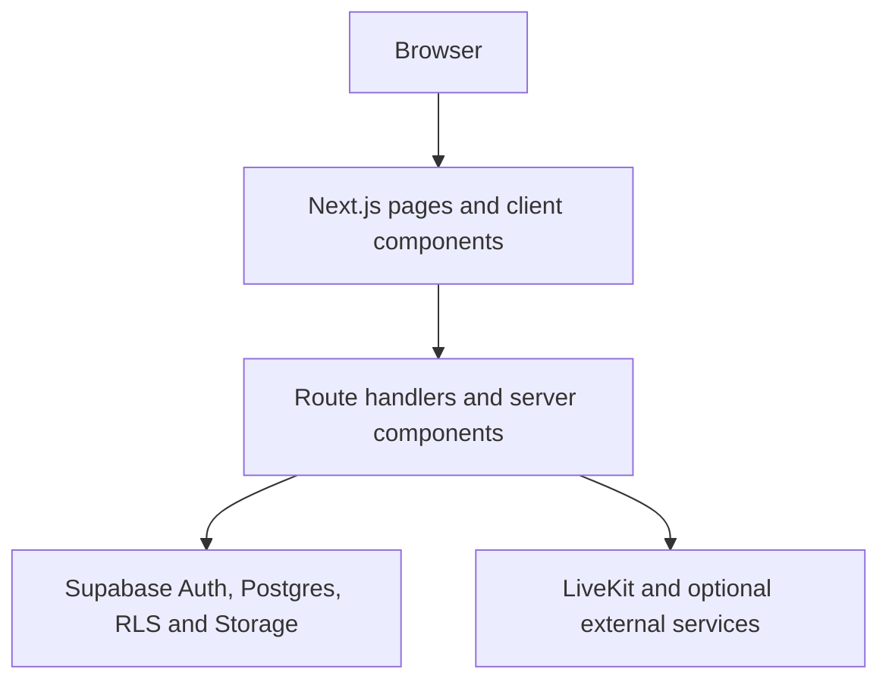

# Architecture

Last audited: 18 August 2026

## System summary

Mettelo is a Next.js App Router application deployed on Vercel. React Server Components render most pages; client components handle interactive forms, navigation, Supabase browser sessions, and live project experiences. Next.js route handlers provide the HTTP/API boundary. Supabase supplies authentication, Postgres, Row Level Security (RLS), and Storage. GitHub Actions and Playwright provide pre-merge and end-to-end gates.

## Technology map

| Layer | Current implementation | Primary evidence |
| --- | --- | --- |
| Web framework | Next.js 15 App Router, React 19, TypeScript | `app/`, `package.json`, `tsconfig.json` |
| UI | Repository CSS layers plus React components; no Tailwind dependency | `app/*.css`, `components/` |
| Identity/data | Supabase Auth, Postgres, RLS, Storage | `lib/supabase/`, `middleware.ts`, `supabase/migrations/` |
| Privileged server work | Supabase service-role client created by `serviceDb()` | `lib/project-flow.ts` |
| Live project events | LiveKit client/server SDK | project-event route handlers and LiveKit components |
| Browser/E2E tests | Playwright, Chromium project | `tests/`, `playwright.config.ts` |
| Static contract checks | Node audit scripts | `scripts/audit-*.mjs` |
| CI | GitHub Actions | `.github/workflows/` |
| Hosting/scheduling | Vercel deployment plus Vercel Cron route invocations | `vercel.json` |

The package manifest currently requests `next ^15.2.4`; do not document an exact installed patch without checking `package-lock.json`.

## Repository layout

| Path | Responsibility |
| --- | --- |
| `app/` | App Router pages, layouts, metadata, route handlers, global CSS, public/member/Admin route trees |
| `components/` | Reusable client/server UI, forms, queues, navigation, workspace and Admin controls |
| `lib/` | Supabase factories, notifications, project lifecycle/governance, opportunity processing, templates, and domain helpers |
| `scripts/` | Contract audits, configuration checks, Admin promotion, and hosted auth-template sync |
| `supabase/migrations/` | Versioned SQL schema, RLS, functions, indexes, seed data, and Storage bucket definitions |
| `supabase/templates/auth/` | Version-controlled Supabase Auth email templates |
| `tests/` | Playwright UI/API contracts, protected-route smoke tests, and staging submission journeys |
| `public/` | Static logos and social/SEO assets |
| `.github/workflows/` | Regression/build gate and Supabase auth-template synchronization |
| `docs/` | Living engineering and product handover documentation |

## Rendering and data-access boundaries

### Browser client

`lib/supabase/client.ts` creates the browser Supabase client with the public URL and publishable/anon key. Client code may use only permissions granted by RLS. Never import the service-role helper into a client component.

### Authenticated server

`lib/supabase/server.ts` creates a cookie-aware server client. Server Components and route handlers use it to resolve the current user and perform member operations under that user's RLS context.

### Public server reads

`lib/supabase/public.ts` supports public content reads without a user session. Public pages must query only records intended to be exposed by grants and RLS.

### Privileged server operations

`lib/project-flow.ts` creates a service-role client only when both the Supabase URL and `SUPABASE_SERVICE_ROLE_KEY` exist. It is used for Admin operations, auth-directory email lookup, protected uploads, notification/outbox work, and server-owned anonymous intake.

The intended boundary is:

- member-owned reads/writes use the authenticated server client and RLS;
- Admin queue rows remain readable to authenticated Admins through Admin RLS;
- service role enriches those rows with protected auth email data and enables privileged state changes;
- anonymous contact, partnership, feedback, newsletter, and career writes go through validated server endpoints.

## Authentication and middleware

`middleware.ts` matches `/member/:path*`, `/admin/:path*`, and `/project-architect`.

1. Missing public Supabase configuration redirects to `/signin?reason=not-configured`.
2. An unauthenticated request redirects to `/signin` and preserves a safe relative `next` destination.
3. `/project-architect` is an authenticated entry route and redirects to `/member/project-architect`.
4. `/admin/*` requires `user.app_metadata.role === "admin"`; other authenticated users return to `/member`.
5. Route handlers and server pages repeat authorization checks. Middleware is not the sole security boundary.

Sign-up is not a separate page in the intended journey: `/signin?mode=signup` selects sign-up mode. Supabase email/OAuth callbacks enter through `/auth/callback`. Canonical copy and hosted template requirements live in [phase-1-auth-content-standard.md](phase-1-auth-content-standard.md).

## Data model

The database is organized around these domains:

| Domain | Representative versioned tables |
| --- | --- |
| Identity and preferences | `profiles`, `account_identities`, domain/tool taxonomy and profile preferences |
| Projects and intake | `projects`, `project_roles`, `project_applications`, `project_application_events`, `project_members` |
| Delivery workspace | milestones, workstreams, tasks/events, discussions/reads, resources, deliverables, data sources and versions |
| Contribution and proof | `contributions`, `contribution_evidence_links`, `contribution_review_events`, public proof/credential data |
| Project Architect/governance | applications, evidence, history, credentials, assignments, reviews, and governance events |
| Opportunities | `opportunities`, saved items, source registry, ingestion runs, verification checks, role taxonomy |
| Events | public events/registrations plus governed project meetings, participants, registrations, attendance, reviews, resources, and audit |
| Careers | offer documents and onboarding items are versioned; see the baseline warning below |
| Organisations and intake | organisations, partnerships, form submissions, notes, history, and proposal documents |
| Communications | templates, template versions, records, audit logs, notifications/outbox data |
| Editorial/recognition | content posts and Spotlight data |

### Schema-bootstrap warning

A static audit found application queries for tables that are not created by any migration currently in `supabase/migrations/`: `career_application_events`, `career_applications`, `career_roles`, `content_posts`, `email_delivery_attempts`, `email_outbox`, `notification_event_catalogue`, `notification_preferences`, `notifications`, and `project_runs`.

Later migrations alter or reference several of them, so an existing hosted database may contain an older/manual baseline. That provenance is not captured in this repository. **Do not bootstrap a blank Supabase project as production-equivalent until the missing baseline is pulled, reviewed, and committed.** See [Open issues](OPEN-ISSUES.md#p0-versioned-supabase-baseline-is-incomplete).

## RLS and database security

- Exposed application tables are expected to have RLS enabled.
- Member policies must combine authentication with ownership/membership predicates; `TO authenticated` alone is not authorization.
- Admin authorization is based on `app_metadata`, not editable `user_metadata`.
- Security-definer functions are explicitly hardened and have controlled `search_path`/execute grants in migrations.
- Foreign-key/filter indexes are maintained in the migration history; the latest hardening pass is `20260817120000_harden_backend_indexes_and_function_path.sql`.
- Run Supabase security and performance advisors after any DDL, function, view, policy, or index change.

## Storage

Versioned migrations create these buckets:

| Bucket | Visibility | Purpose |
| --- | --- | --- |
| `profile-images` | Public | Member profile avatars; ownership policies restrict mutation |
| `career-offer-documents` | Private | PDF offer documents served by short-lived signed URL |
| `intake-proposals` | Private | Admin-managed partnership proposal PDFs |

The careers application endpoint uploads CVs to private bucket `career-cvs`, but no migration in the repository creates that bucket or its policies. This is part of the P0 schema-baseline issue.

## Environment variables

Use `.env.example` as the authoritative name list. Never commit values.

| Variable | Exposure | Requirement/use |
| --- | --- | --- |
| `NEXT_PUBLIC_SUPABASE_URL` | Browser + server | Required by build configuration check and all Supabase clients |
| `NEXT_PUBLIC_SUPABASE_ANON_KEY` | Browser + server | Required public/publishable key; protected by RLS |
| `SUPABASE_SERVICE_ROLE_KEY` | Server only | Required by build check and privileged routes; never prefix with `NEXT_PUBLIC_` |
| `NEXT_PUBLIC_SITE_URL` | Browser + server | Auth callback/canonical origin; set explicitly for local, Preview, and Production |
| `LIVEKIT_URL`, `NEXT_PUBLIC_LIVEKIT_URL` | Server / browser | Required only for live project-event rooms |
| `LIVEKIT_API_KEY`, `LIVEKIT_API_SECRET` | Server only | Required only for LiveKit token generation |
| `NEXT_PUBLIC_GA_MEASUREMENT_ID` | Browser | Optional Google Analytics measurement ID |
| `LUMA_API_KEY`, `YOUTUBE_API_KEY` | Server only | Optional content/event integrations; current use must be confirmed before enabling |
| `MAKE_WEBHOOK_SECRET` | Server only | Optional webhook verification; current integration scope is TODO: confirm |
| `E2E_*` | CI/test process | Dedicated staging URL, Supabase project, service key, and disposable test identities |

`scripts/check-deployment-config.mjs` fails the production build when the two public Supabase variables or service-role key are absent. Feature-specific variables fail at the relevant route with a clear `503` rather than at build time.

## Scheduled operations

`vercel.json` invokes authenticated cron handlers for:

| UTC schedule | Route | Responsibility |
| --- | --- | --- |
| Daily 05:15 | `/api/cron/opportunity-discovery` | Discover opportunity candidates |
| Daily 05:45 | `/api/cron/opportunity-lifecycle` | Update opportunity lifecycle/reverification state |
| Daily 06:15 | `/api/cron/project-formation` | Advance project team formation |
| Daily 07:15 | `/api/cron/saved-opportunity-reminders` | Notify members about saved opportunities |
| Daily 08:15 | `/api/cron/email-delivery` | Process the email outbox |
| Daily 09:15 | `/api/cron/project-event-reminders` | Send meeting/event reminders and expire offers |
| Day 1, 00:10 | `/api/cron/monthly-spotlight` | Run monthly Spotlight selection workflow |

Cron handlers authorize with `CRON_SECRET` as supplied by Vercel; it is not listed in `.env.example` because Vercel supplies it for Cron requests. **TODO: confirm the Production project has Vercel Cron and `CRON_SECRET` configured as expected.**

## Payments

No payment provider, checkout route, webhook, billing table, or payment dependency was found. Before adding payments, define ownership, webhook verification, idempotency, reconciliation, refund, secret-rotation, test-mode, and data-retention decisions in this handbook and [DECISIONS.md](DECISIONS.md).
